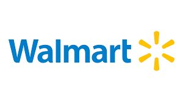
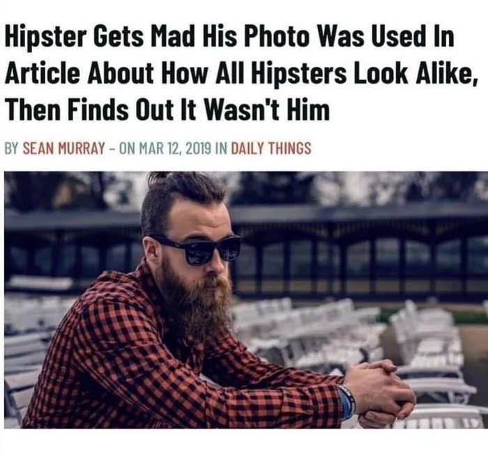
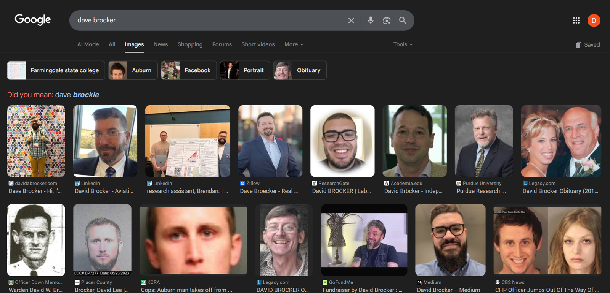
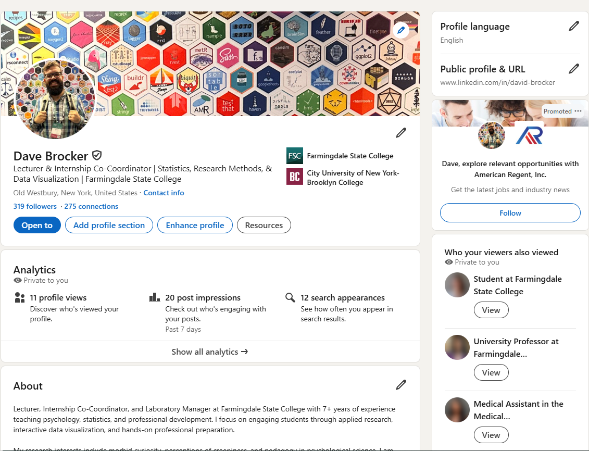
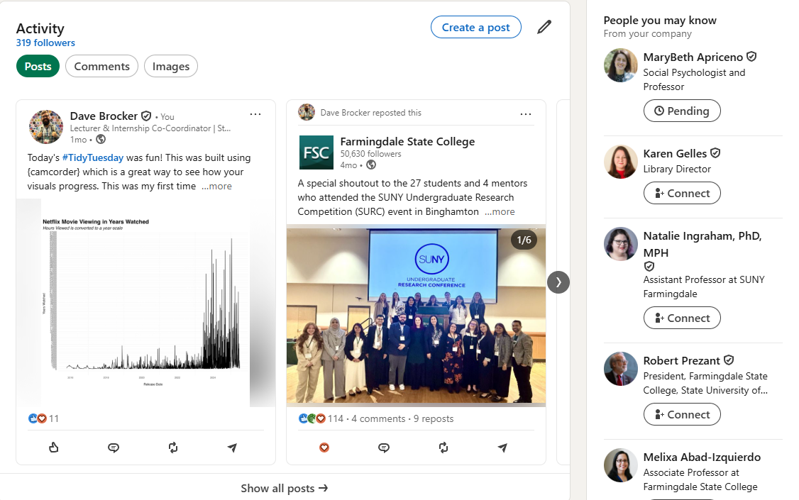
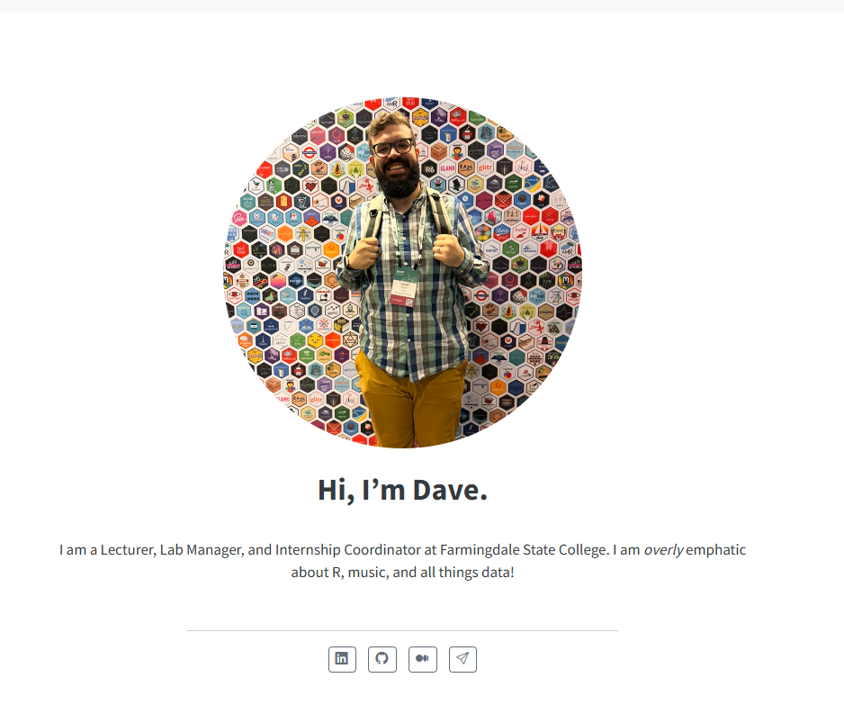

<!-- ============================================================= -->
<!-- TITLE — custom confetti slide (442 identity). No YAML title.   -->
<!-- ============================================================= -->

##  {#custom-title data-menu-title="Personal Branding"}

::: title-confetti
::: title-main
Personal Branding
:::

::: title-sub
What is it and *(why)* does it matter?
:::

::: punch-row
[PSY 442]{.punch-pill} [Senior Project I]{.punch-pill} [Dave Brocker]{.punch-pill}
:::
:::

<!-- ============================================================= -->
<!-- HOOK                                                           -->
<!-- ============================================================= -->

## What makes you unique? {.center-title}

[Identify what you can bring to a team or organization.]{.you-callout}

::: notes
Opening discussion — let a few students answer out loud before moving on.
:::

# What is a mission statement? {.section-break}

## Identify the company behind the mission statement {.center-title}

[Statement first — call it out — *then* the logo.]{.sticker-tag}

<!-- ============================================================= -->
<!-- MISSION GUESSING GAME — one slide per company, logo on reveal  -->
<!-- (collapses the old 2-slides-per-company build)                 -->
<!-- ============================================================= -->

## Mission statement {.mission-slide}

[01]{.mission-num}

> To organize the world's information and make it universally accessible and useful.

::: fragment
::: reveal-brand
{.brand-logo fig-alt="Google logo"}

**Google**
:::
:::

## Mission statement {.mission-slide}

[02]{.mission-num}

> To make all athletes better through passion, design and the relentless pursuit of innovation.

::: fragment
::: reveal-brand
{.brand-logo fig-alt="Nike logo"}

**Nike**
:::
:::

## Mission statement {.mission-slide}

[03]{.mission-num}

> To inspire and nurture the human spirit — one person, one cup and one neighborhood at a time.

::: fragment
::: reveal-brand
{.brand-logo fig-alt="Starbucks logo"}

**Starbucks**
:::
:::

## Mission statement {.mission-slide}

[04]{.mission-num}

> To refresh the world and make a difference.

::: fragment
::: reveal-brand
{.brand-logo fig-alt="Coca-Cola logo"}

**Coca-Cola**
:::
:::

## Mission statement {.mission-slide}

[05]{.mission-num}

> To be a company that inspires and fulfills your curiosity.

::: fragment
::: reveal-brand
{.brand-logo fig-alt="Sony logo"}

**Sony**
:::
:::

## Mission statement {.mission-slide}

[06]{.mission-num}

> We save people money so they can live better.

::: fragment
::: reveal-brand
{.brand-logo fig-alt="Walmart logo"}

**Walmart**
:::
:::

<!-- ============================================================= -->
<!-- NEW SLIDE 22 — "Your turn" mission exercise (the expansion)    -->
<!-- Uses the deck's own Goals frame; Dave models it himself.       -->
<!-- ============================================================= -->

## Now write yours {.your-turn}

::: {.your-turn-frame}
Using the same frame those companies used:

- **Who** is your audience?
- **What** problem do you solve?
- **How** do you solve it?

Then compress it to **one line.**
:::

::: fragment
::: worked-example
*Worked example — my brand, DataVizWithDave:*

> To turn curiosity into data — and data into insight and action.
:::
:::

::: notes
Model it live: walk the three questions for DataVizWithDave, then show how they
collapse into the one-liner. "I'll only ask you to do what I'll do myself."
:::

<!-- ============================================================= -->
<!-- BUILDING A PERSONAL BRAND — 4 principles                       -->
<!-- Old deck repeated an icon-nav row on 23/25/27/29; collapsed.   -->
<!-- ============================================================= -->

# Building a personal brand {.section-break}

## Be Authentic {.principle}

{.principle-icon fig-alt="authenticity icon"}

<!-- Old deck: title + icon only. Optional one-line gloss to add live/on-slide. -->

## Function in a Spectrum {.principle}

{.principle-icon fig-alt="spectrum icon"}

## Map Out Strategies {.principle}

{.principle-icon fig-alt="strategy icon"}

## Quality over Quantity {.principle}

{.principle-icon fig-alt="quality icon"}

<!-- ============================================================= -->
<!-- DEFINITION                                                     -->
<!-- ============================================================= -->

## Personal branding, defined {.center-title}

Personal Branding
: A conscious effort to influence public perception.

<!-- ^ compiles to a .hero-def card via the site's definition-list styling -->

<!-- ============================================================= -->
<!-- YOUR BRAND HUB — Purpose · Vision · Goals · Unique Attributes  -->
<!-- Old deck morph-built this across 32–37; collapsed to hub +     -->
<!-- two detail slides.                                             -->
<!-- ============================================================= -->

## Your Brand {.brand-hub}

::: hub-spokes
::: {.spoke .fragment}
**Purpose**
:::
::: {.spoke .fragment}
**Vision**
:::
::: {.spoke .fragment}
**Goals**
:::
::: {.spoke .fragment}
**Unique Attributes**
:::
:::

## Goals {.center-title}

::: term-list
::: fragment
Who is my target audience?
: Who are you actually speaking to?
:::
::: fragment
What problems am I solving?
: What need do you meet for them?
:::
::: fragment
How will I solve those problems?
: What's your approach — the *how* only you bring?
:::
:::

[Sound familiar? This is the same frame you used for your mission statement.]{.sticker-tag}

## Unique Attributes {.center-title}

::: term-list
::: fragment
Significant Attributes
: What genuinely sets you apart?
:::
::: fragment
Successes and Failures
: What have you learned — from both?
:::
:::

<!-- ============================================================= -->
<!-- DOES IT MATTER? — differentiation                             -->
<!-- ============================================================= -->

# Does it matter? {.section-break}

## Don't Blend In {.center-title}

{.side-figure fig-alt="crowd / blending in"}

> The market is saturated with individuals possessing the same relative skills.

## Be Personable {.center-title}

::: fragment
[Be Approachable]{.sticker-tag}
:::

## Use Other Skills {.center-title}

[What do you know!]{.you-callout}

::: icon-row
::: icon-row-item
{fig-alt="skill icon"}
:::
::: icon-row-item
{fig-alt="skill icon"}
:::
::: icon-row-item
{fig-alt="skill icon"}
:::
:::

## Learn New Skills {.center-title}

::: icon-row
::: icon-row-item
{fig-alt="new skill icon"}
:::
::: icon-row-item
{fig-alt="new skill icon"}
:::
::: icon-row-item
{fig-alt="new skill icon"}
:::
::: icon-row-item
{fig-alt="new skill icon"}
:::
::: icon-row-item
{fig-alt="new skill icon"}
:::
::: icon-row-item
{fig-alt="new skill icon"}
:::
::: icon-row-item
{fig-alt="new skill icon"}
:::
:::

<!-- ============================================================= -->
<!-- REPUTATION TRIAD — was morph-animated SmartArt (45–48).        -->
<!-- Collapsed to one slide, three reveal cards.                    -->
<!-- ============================================================= -->

## Be the person people want to work with {.center-title}

::: badge-row
::: {.content-badge .fragment}
**Be the person people go-to**

- Steady track record of problem solving
- Helping others
:::
::: {.content-badge .fragment}
**Accept and Offer Feedback**

- Incorporate it
- Keep it constructive
:::
::: {.content-badge .fragment}
**Produce High Quality Work**

- Detail oriented
- Considerate
:::
:::

<!-- ============================================================= -->
<!-- NETWORKING                                                     -->
<!-- ============================================================= -->

# Building your network {.section-break}

## Your Network {.center-title}

::: icon-row
::: {.icon-row-item .fragment}
Leaders in your Field
:::
::: {.icon-row-item .fragment}
Past Bosses
:::
::: {.icon-row-item .fragment}
Coworkers
:::
::: {.icon-row-item .fragment}
Groups in your Field
:::
:::

## Becoming More Visible {.center-title}

Being an active member of your field makes your presence noted, and more frequent.

::: incremental
- Document your progress
- Note the accomplishments of others
:::

## When you're in the room {.center-title}

::: badge-row
::: content-badge
{.badge-icon fig-alt=""} Be yourself
:::
::: content-badge
{.badge-icon fig-alt=""} Have a sense of humor
:::
::: content-badge
{.badge-icon fig-alt=""} Be dependable
:::
::: content-badge
{.badge-icon fig-alt=""} Speak well
:::
::: content-badge
{.badge-icon fig-alt=""} Dress well
:::
::: content-badge
{.badge-icon fig-alt=""} Remember names
:::
:::

<!-- ============================================================= -->
<!-- ONLINE PRESENCE AUDIT — the gag (59–62) as a fragment reveal   -->
<!-- ============================================================= -->

## Audit your online presence {.audit-slide}

{.audit-shot fig-alt="online presence audit screenshot"}

::: fragment
[R.I.P]{.audit-verdict}
:::
::: fragment
[Uh Oh.]{.audit-verdict}
:::
::: fragment
[Score: 4 / 15]{.audit-score}
:::

::: notes
Live bit — walk the audit, let the reactions land one at a time, reveal the score.
:::

<!-- ============================================================= -->
<!-- ASSOCIATE WITH STRONG BRANDS — psych associations (KEEP)       -->
<!-- ============================================================= -->

## Associate with other strong brands {.center-title}

::: assoc-grid
- American Psychological Association (APA)
- Association for Psychological Science (APS)
- Eastern Psychological Association (EPA)
- National Association of School Psychologists (NASP)
- Society for Industrial and Organizational Psychology (SIOP)
- Society for Human Resource Management (SHRM)
- Association for Talent Development (ATD)
- American Psychology-Law Society (APA Div. 41)
:::

<!-- TODO (expand): link each to its site / add a QR so students can join. -->

## …and more {.center-title}

::: assoc-grid
- Society for Judgment and Decision Making (SJDM)
- Society for Personality and Social Psychology (SPSP)
- Society for Social Neuroscience (S4SN)
- Society for the Teaching of Psychology (STP, APA Div. 2)
- Society of Experimental Psychologists (SEP)
- Society of Experimental Social Psychology (SESP)
:::

<!-- ============================================================= -->
<!-- LINKEDIN                                                       -->
<!-- ============================================================= -->

# Develop a LinkedIn profile {.section-break}

## Anatomy of a profile {.center-title}

{.linkedin-shot fig-alt="LinkedIn profile screenshot"}

::: term-list
Heading
: Full description of responsibilities + education
About
: Who are you, what do you do?
Profile Picture
: People want to know it's you!
Analytics
: Is your profile engaging?
:::

## Keep it current {.center-title}

{.linkedin-shot fig-alt="LinkedIn activity screenshot"}

::: term-list
Activity
: What have you done recently?
Betrayal
: *What did I do?!*
:::

<!-- ============================================================= -->
<!-- WEBSITE — the orphan slide, expanded to a live show-and-tell   -->
<!-- ============================================================= -->

## Develop a website {.center-title}

{.website-shot fig-alt="personal website screenshot"}

::: fragment
[A living home for your work — where you control the whole brand.]{.sticker-tag}
:::

::: fragment
Live example — my own:
[davidabrocker.com](https://davidabrocker.com) · **DataVizWithDave**
:::

::: notes
Show-and-tell: walk davidabrocker.com live — the About page mission line, a post
or two, how the pieces reinforce one brand.
:::
